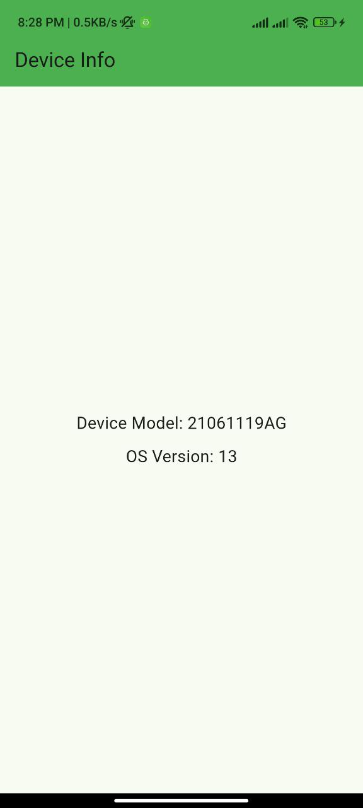

# Device Info App

This Flutter app displays the device model and operating system version in the center of the screen.

## Code Explanation

- `device_info_service.dart`: Contains the logic to fetch device info using the `device_info_plus`
  package.
- `home_screen.dart`: Displays the device info in the center of the screen.
- `main.dart`: The main entry point of the app.

## Permissions

- **Android:** Add the following to `AndroidManifest.xml`:
  ```xml
  <uses-permission android:name="android.permission.READ_PHONE_STATE"/>
  ```
- **iOS:** Add the following to `Info.plist`:
  ```xml
  <key>NSPrivacyAccessedDevicesUsageDescription</key>
  <string>This app requires access to device information.</string>
  ```

## Installation

1. Clone the repository.
2. Run `flutter pub get`.
3. Run the app using `flutter run`.

## Screenshot

| Output                        |
|-------------------------------|
|  |